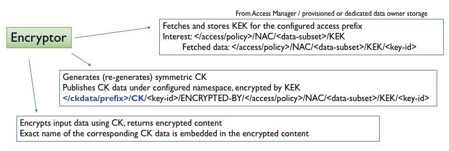

NAC Specification
=================

.. figure:: _static/nac-overview.png
   :alt: Overview of NAC entities
   :align: center

Terminology
-----------

+-----------------+------------------------------------------------------------------------------------------+
| Term            |  Description                                                                             |
+=================+==========================================================================================+
| KEK             |  Key Encryption Key (RSA public key)                                                     |
+-----------------+------------------------------------------------------------------------------------------+
| KDK             |  Key Decryption Key (RSA private key)                                                    |
+-----------------+------------------------------------------------------------------------------------------+
| CK              |  Content Key (AES symmetric key)                                                         |
+-----------------+------------------------------------------------------------------------------------------+
| CK data         |  Data packet carrying a KDK-encrypted CK as payload                                      |
+-----------------+------------------------------------------------------------------------------------------+
| Access Manager  |  (Data Owner) Entity that control access to the data associated with the namespace       |
+-----------------+------------------------------------------------------------------------------------------+
| Encryptor       |  (Producer) Entity that encrypts data based on namespace association                     |
+-----------------+------------------------------------------------------------------------------------------+
| Decryptor       |  (Consumer) Entity that decrypts data based on namespace association                     |
+-----------------+------------------------------------------------------------------------------------------+

EncryptedContent
----------------

The ``EncryptedContent`` element contains encrypted blob, optional Initial Vector (for AES CBC encryption),
optional EncryptedPayloadKey, and Name elements.

::

     EncryptedContent ::= ENCRYPTED-CONTENT-TYPE TLV-LENGTH
                            EncryptedPayload
                            InitializationVector?
                            EncryptedPayloadKey?
                            Name?

     EncryptedPayload ::= ENCRYPTED-PAYLOAD-TYPE TLV-LENGTH(=N) BYTE{N}
     InitializationVector ::= INITIALIZATION-VECTOR-TYPE TLV-LENGTH(=N) BYTE{N}
     EncryptedPayloadKey ::= ENCRYPTED-PAYLOAD-KEY-TYPE TLV-LENGTH(=N) BYTE{N}

Access Manager
--------------

.. figure:: _static/access-manager.png
   :alt: Access Manager
   :align: center

Access Manager controls decryption policy by publishing granular per-namespace access policies in the form of key encryption (KEK, plaintext public) and key decryption (KDK, encrypted private key) key pair.

KEK is published as a single data packet with name ``/[access-namespace]/NAC/[dataset]/KEK/[key-id]``, following the following format:

::

   Kek ::= DATA-TYPE TLV-LENGTH
             Name (= /[access-namespace]/NAC/[dataset]/KEK/[key-id])
             MetaInfo (= .ContentType = KEY, .FreshnessPeriod = 1 hour default value)
             KekContent
             SignatureInfo
             SignatureValue

   KekContent ::= CONTENT-TYPE-TLV TLV-LENGTH
                    BYTE* (= BER of public key /[access-namespace]/NAC/[dataset]/KEY/[key-id])

Different versions of KDK are published, encrypted by the public key of the individual authorized member, following naming convention: ``/[access-namespace]/NAC/[dataset]/KDK/[key-id]/ENCRYPTED-BY/<authorized-member>/KEY/[member-key-id]``.  KDK is published in the following format:

::

   Kdk ::= DATA-TYPE TLV-LENGTH
             Name (= /[access-namespace]/NAC/[dataset]/KDK/[key-id]/ENCRYPTED-BY/<authorized-member>/KEY/[member-key-id])
             MetaInfo (= .ContentType = BLOB, .FreshnessPeriod = 1 hour default value)
             KdkContent
             SignatureInfo
             SignatureValue

   KdkContent ::= CONTENT-TYPE-TLV TLV-LENGTH
                    EncryptedContent (=
                      .EncryptedPayload = SafeBag with private key /[access-namespace]/NAC/[dataset]/KEY/[key-id]
                      .EncryptedPayloadKey = password for SafeBag, encrypted by public key /<authorized-member>/KEY/[member-key-id]
                      // .InitializationVector and .Name are not set
                    )

Encryptor
---------

Encryptor encrypts (synchronous operation) the requested content and returns an ``EncryptedContent`` element with values:

::

     EncryptedPayload      = AES CBC encrypted blob
     InitializationVector         = Random initial vector for AES CBC encryption
     EncryptedPayloadKey (not set)
     Name                  = Prefix of ContentKey (CK) data packet [ck-prefix]/CK/[ck-id]

During initialization or when requested by the application, the Encryptor (re-)generates a random key for AES CBC encryption.
The encrypted version of this key is published (asynchronous operation, contingent on successful retrieval and validation of KEK) as a data packet, following the naming convention: ``/[ck-prefix]/CK/[ck-id]/ENCRYPTED-BY/[access-namespace]/NAC/[dataset]/KEK/[key-id]``.  CK data is published in the following format:

::

   CkData ::= DATA-TYPE TLV-LENGTH
                Name (= /[ck-prefix]/CK/[ck-id]/ENCRYPTED-BY/[access-namespace]/NAC/[dataset]/KEK/[key-id])
                MetaInfo (= .ContentType = BLOB, .FreshnessPeriod = 1 hour default value)
                CkContent
                SignatureInfo
                SignatureValue

   CkContent ::= CONTENT-TYPE-TLV TLV-LENGTH
                    EncryptedContent (=
                      .EncryptedPayload = ContentKey encrypted by public key /[access-namespace]/NAC/[dataset]/KEK/[key-id]
                      // .InitializationVector, .EncryptedPayloadKey, and .Name are not set
                    )
