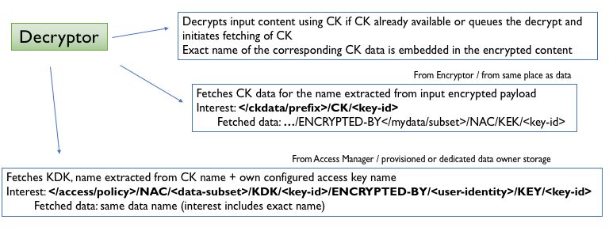

NAC Specification
=================

.. figure:: _static/nac-overview.png
   :alt: Overview of NAC entities
   :align: center

Terminology
-----------

+-----------------+------------------------------------------------------------------------------------------+
| Term            |  Description                                                                             |
+=================+==========================================================================================+
| KEK             |  Key Encryption Key (RSA public key)                                                     |
+-----------------+------------------------------------------------------------------------------------------+
| KDK             |  Key Decryption Key (RSA private key)                                                    |
+-----------------+------------------------------------------------------------------------------------------+
| CK              |  Content Key (AES symmetric key)                                                         |
+-----------------+------------------------------------------------------------------------------------------+
| CK data         |  Data packet carrying a KDK-encrypted CK as payload                                      |
+-----------------+------------------------------------------------------------------------------------------+
| Access Manager  |  (Data Owner) Entity that control access to the data associated with the namespace       |
+-----------------+------------------------------------------------------------------------------------------+
| Encryptor       |  (Producer) Entity that encrypts data based on namespace association                     |
+-----------------+------------------------------------------------------------------------------------------+
| Decryptor       |  (Consumer) Entity that decrypts data based on namespace association                     |
+-----------------+------------------------------------------------------------------------------------------+

EncryptedContent
----------------

The ``EncryptedContent`` element contains encrypted blob, optional Initialization Vector (for AES CBC encryption),
optional EncryptedPayloadKey, and Name elements.

.. code-block:: abnf

     EncryptedContent = ENCRYPTED-CONTENT-TYPE TLV-LENGTH
                        EncryptedPayload
                        [InitializationVector]
                        [EncryptedPayloadKey]
                        [Name]

     EncryptedPayload = ENCRYPTED-PAYLOAD-TYPE TLV-LENGTH *OCTET
     InitializationVector = INITIALIZATION-VECTOR-TYPE TLV-LENGTH *OCTET
     EncryptedPayloadKey = ENCRYPTED-PAYLOAD-KEY-TYPE TLV-LENGTH *OCTET

Access Manager
--------------

.. figure:: _static/access-manager.png
   :alt: Access Manager
   :align: center

Access Manager controls decryption policy by publishing granular per-namespace access policies in the form of key encryption (KEK, plaintext public) and key decryption (KDK, encrypted private key) key pair.

KEK is published as a single data packet with name ``/[access-namespace]/NAC/[dataset]/KEK/[key-id]``, following the following format:

.. code-block:: abnf

   Kek = DATA-TYPE TLV-LENGTH
         Name     ; /[access-namespace]/NAC/[dataset]/KEK/[key-id]
         MetaInfo ; ContentType = KEY, FreshnessPeriod = 1 hour default value
         KekContent
         DataSignature

   KekContent = CONTENT-TYPE-TLV TLV-LENGTH
                *OCTET ; = BER of public key /[access-namespace]/NAC/[dataset]/KEY/[key-id]

Different versions of KDK are published, encrypted by the public key of the individual authorized member, following naming convention: ``/[access-namespace]/NAC/[dataset]/KDK/[key-id]/ENCRYPTED-BY/<authorized-member>/KEY/[member-key-id]``.  KDK is published in the following format:

.. code-block:: abnf

   Kdk = DATA-TYPE TLV-LENGTH
         Name     ; /[access-namespace]/NAC/[dataset]/KDK/[key-id]/ENCRYPTED-BY/<authorized-member>/KEY/[member-key-id]
         MetaInfo ; ContentType = BLOB, FreshnessPeriod = 1 hour default value
         KdkContent
         DataSignature

   KdkContent = CONTENT-TYPE-TLV TLV-LENGTH
                EncryptedContent

Within the ``EncryptedContent`` element,

* ``EncryptedPayload`` contains `SafeBag <https://named-data.net/doc/ndn-cxx/0.7.1/specs/safe-bag.html>`__ of private key ``/[access-namespace]/NAC/[dataset]/KEY/[key-id]``
* ``EncryptedPayloadKey`` contains password for SafeBag, encrypted by public key ``/<authorized-member>/KEY/[member-key-id]``
* ``InitializationVector`` and ``Name`` must be omitted

Encryptor
---------

.. figure:: _static/encryptor.png
   :alt: Encryptor
   :align: center

Encryptor encrypts (synchronous operation) the requested content and returns an ``EncryptedContent`` element with values:

::

     EncryptedPayload      = AES CBC encrypted blob
     InitializationVector  = Random initial vector for AES CBC encryption
     EncryptedPayloadKey   (not set)
     Name                  = Prefix of ContentKey (CK) data packet /[ck-prefix]/CK/[ck-id]

During initialization or when requested by the application, the Encryptor (re-)generates a random key for AES CBC encryption.
The encrypted version of this key is published (asynchronous operation, contingent on successful retrieval and validation of KEK) as a data packet, following the naming convention: ``/[ck-prefix]/CK/[ck-id]/ENCRYPTED-BY/[access-namespace]/NAC/[dataset]/KEK/[key-id]``.  CK data is published in the following format:

.. code-block:: abnf

   CkData = DATA-TYPE TLV-LENGTH
            Name     ; /[ck-prefix]/CK/[ck-id]/ENCRYPTED-BY/[access-namespace]/NAC/[dataset]/KEK/[key-id]
            MetaInfo ; ContentType = BLOB, FreshnessPeriod = 1 hour default value
            CkContent
            DataSignature

   CkContent = CONTENT-TYPE-TLV TLV-LENGTH
               EncryptedContent

Within the ``EncryptedContent`` element,

* ``EncryptedPayload`` contains ContentKey encrypted by public key ``/[access-namespace]/NAC/[dataset]/KEK/[key-id]``
* ``EncryptedPayloadKey``, ``InitializationVector``, and ``Name`` must be omitted

Decryptor
---------

Encryptor decrypts (asynchronous operation, contingent on successful retrieval of CK data, KDK, and decryption of both) the supplied ``EncryptedContent`` element.

TLV-TYPE number assignments
---------------------------

+---------------------------------------------+------------------+-----------------+
| Type                                        | Assigned number  | Assigned number |
|                                             | (decimal)        | (hexadecimal)   |
+=============================================+==================+=================+
| EncryptedContent                            | 130              | 0x82            |
+---------------------------------------------+------------------+-----------------+
| EncryptedPayload                            | 132              | 0x84            |
+---------------------------------------------+------------------+-----------------+
| InitializationVector                        | 133              | 0x85            |
+---------------------------------------------+------------------+-----------------+
| EncryptedPayloadKey                         | 134              | 0x86            |
+---------------------------------------------+------------------+-----------------+
